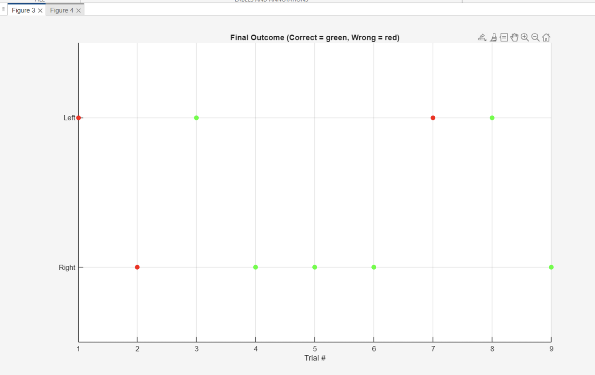
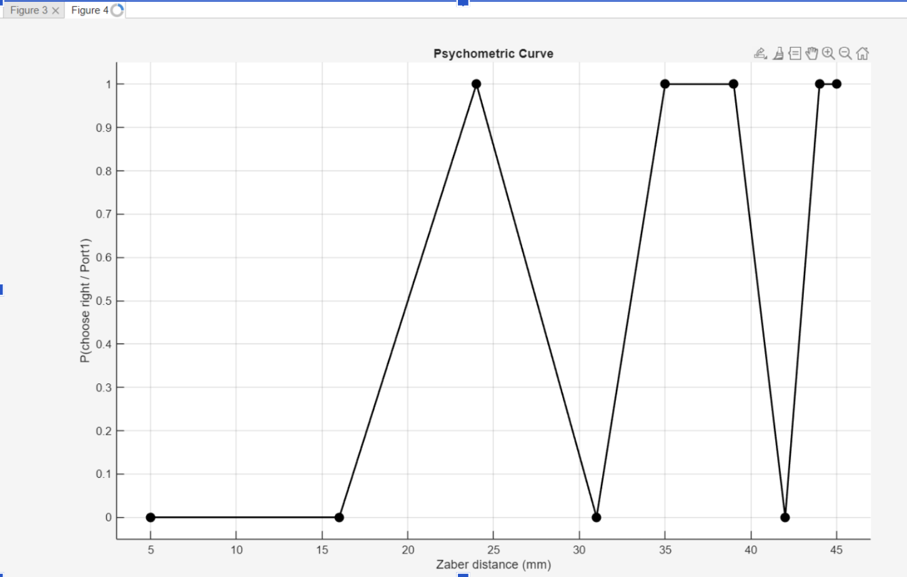

# Bpod-Zaber-2AFC

Behavioral 2AFC licking task integrating Bpod state machines, Zaber motion control, and online psychometric analysis.

---

# Overview

This project implements a two-alternative forced-choice (2AFC) licking task for mice using a Bpod behavioral control system and a Zaber linear actuator.

During each trial, the Zaber actuator moves a wall to a target spatial position. The animal must discriminate the wall location and report its decision through left or right licking responses. Correct responses trigger water reward delivery, while incorrect responses trigger timeout punishment.

The task includes real-time behavioral visualization and online performance analysis.

---

# Features

- Bpod state machine control
- Zaber actuator integration
- Left/right licking behavioral task
- Real-time outcome plotting
- Online psychometric curve generation
- Confusion matrix calculation
- Accuracy, precision, and recall statistics
- Trial-by-trial behavioral logging

---

# Hardware Requirements

- Bpod Gen2
- Zaber linear actuator
- Two lick ports
- Solenoid reward valves
- LED cue lights
- Water reward system

---

# Software Requirements

- MATLAB
- Bpod MATLAB package
- Zaber Motion Library

---

# Task Structure

Each trial consists of:

1. Inter-trial interval (ITI)
2. Zaber wall movement
3. Cue onset
4. Response window
5. Reward or punishment
6. Trial completion

---

# Behavioral Logic

Wall positions are divided into left-condition and right-condition trials.

- Far positions → left lick response
- Near positions → right lick response

## Correct Response
- Corresponding reward valve opens
- Water reward delivered
- Trial marked as rewarded

## Incorrect Response
- No reward delivered
- Timeout punishment applied

## No Response
- Trial marked as omission

---

# Running the Task

Open MATLAB and run:

```matlab
Lick_twoValve
```

Make sure:
- Bpod is connected
- Zaber actuator is initialized
- Correct COM ports are configured
- Zaber Motion Library is installed

---

# Example Trial Flow

```text
Trial Start
    ↓
Move Wall Position
    ↓
LED Cue On
    ↓
Wait for Lick Response
    ↓
 ┌───────────────┬───────────────┐
 │ Correct Lick  │ Incorrect Lick│
 └───────────────┴───────────────┘
        ↓                 ↓
    Reward          Timeout
        ↓                 ↓
           Inter-Trial Interval
```
# Outputs

## Online Outputs

During task execution, the protocol displays real-time behavioral information including:

- Trial number
- Wall distance (`dist`)
- Intended correct response/valve
- Left/right trial outcome visualization using `SideOutcomePlot()`

### Outcome Plot Color Convention

- Green = correct response
- Red = incorrect/missed response

---

## Offline Outputs

After experiment completion, the protocol generates:

- Confusion matrix
- Accuracy metrics
- Precision and recall statistics
- Saved outcome plot
- Saved psychometric curve
---
# Example Outputs

## Outcome Plot



---

## Psychometric Curve



---

## Example Console Output

```text
Starting Bpod Console v1.8.1
Bpod State Machine r2_Plus connected on port COM4

Starting LickTwoValveOutput

Trial 1 | dist=42 | correctValve=1
Trial 2 | dist=24 | correctValve=2
Trial 3 | dist=5  | correctValve=2
Trial 4 | dist=39 | correctValve=1
Trial 5 | dist=44 | correctValve=1
Trial 6 | dist=45 | correctValve=1
Trial 7 | dist=31 | correctValve=1
Trial 8 | dist=16 | correctValve=2
Trial 9 | dist=35 | correctValve=1

===== CONFUSION MATRIX =====

LL (Left  → Left):   22.2% (2/9)
LR (Left  → Right):  11.1% (1/9)
RL (Right → Left):   22.2% (2/9)
RR (Right → Right):  44.4% (4/9)

===== METRICS =====

Accuracy:         0.667
Right Precision:  0.800
Right Recall:     0.667
Left Precision:   0.500
Left Recall:      0.667

Confusion Matrix:

                 PredLeft   PredRight
TrueLeft              2          1
TrueRight             2          4

Experiment finished
```

---

## Performance Metrics

Example behavioral performance statistics generated during the task:

- Accuracy
- Precision
- Recall
- Left/right response percentages

---

## Experimental Setup (Optional)

Hardware setup including Bpod, Zaber actuator, lick ports, and reward system.

(will take pictures later)


---
# Possible Troubleshooting / Important Notes

## Zaber Connection Error

If the following error appears before running the protocol:

```matlab
Error in LickTwoValveTest (line 9)
conn = zaber.motion.ascii.Connection.openSerialPort(char(comPort));
```

the Zaber Java library is likely not loaded correctly.

---

## Quick Temporary Fix

Run every time MATLAB is opened:

```matlab
matlab.addons.install("C:\Users\Ephys\Downloads\Zaber Motion Library.mltbx")
```

Note:
- temporary only
- resets after MATLAB closes
- must rerun every session

---

## Permanent Fix (Recommended)

### 1. Create `startup.m`

```matlab
edit(fullfile(userpath,'startup.m'))
```

If prompted:

```text
File does not exist. Create?
```

click `YES`.

---
### 2. Locate the Zaber `.jar` File

Find the installed Zaber Motion Library `.jar` file on your system.

Typical Windows location:

```text
C:\Users\USERNAME\AppData\Roaming\MathWorks\MATLAB Add-Ons\
```

Search for:

```text
motion-library-jar-with-dependencies.jar
```

---

### 3. Add the Library to MATLAB Startup

Open/create `startup.m`:

```matlab
edit(fullfile(userpath,'startup.m'))
```

Add:

```matlab
javaaddpath('FULL_PATH_TO/motion-library-jar-with-dependencies.jar')

rehash toolboxcache
```

Example:

```matlab
javaaddpath('C:\path\to\motion-library-jar-with-dependencies.jar')

rehash toolboxcache
```

Save the file and restart MATLAB.

---

### 4. Verify Successful Installation

Run:

```matlab
methods zaber.motion.ascii.Connection
```

If successful, MATLAB will display the available Zaber connection methods.


---

## Additional Notes

- Ensure actuator is homed before task start!
- Verify COM ports in Device Manager
- Close previous serial connections before reconnecting
- Avoid manually obstructing actuator movement
- Restart MATLAB if serial ports become busy/UX error happens

---

# Acknowledgements

This project was developed using the Bpod behavioral control framework and Zaber motion control libraries.
